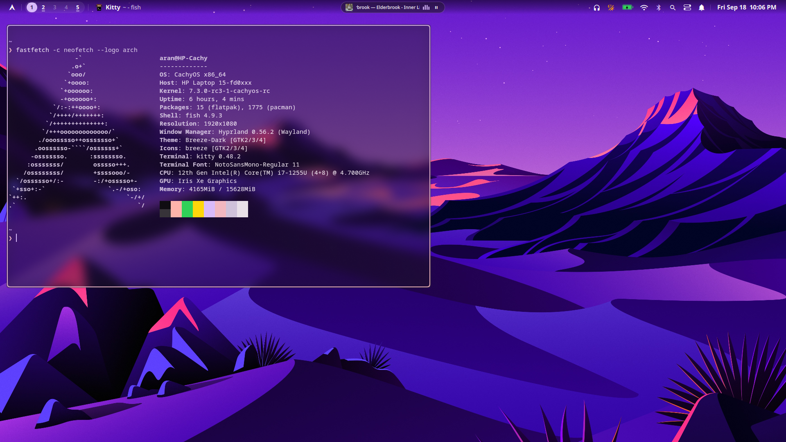

# 🌌 Hyprland & Quickshell Desktop Suite

A modern, fluid desktop environment built on **Hyprland (Wayland)** and powered by **Quickshell (Qt6/QML)**. Combines the refined aesthetics of **macOS Tahoe** with dynamic **Google Material You** wallpaper color palettes.





---

## Features

###  iOS Inspired Dynamic Island
* **Multi-State Fluid Morphing**: Built with organic spring physics (`Easing.OutBack`) to adapt across desktop events:
  * **Compact Media Pill**: True OLED pitch-black (`#000000`) pill with specular glass rim, album art thumbnail, scrolling typography, live Cava waveform visualizer, and minimal play/pause toggle.
  * **Expanded Media Player**: Springs open into an interactive media card with high-res album art, interactive timeline scrubber (drag & wheel seek), time codes, and audio controls. Click-outside and 3s inactivity dismissal.
  * **System OSD**: Volume, brightness, and mute overlays.
  * **Toast Notifications**: Interactive toasts morph directly into the island.
* **Live Cava Audio Visualizer**: 4-bar dynamic audio equalizer driven directly by audio output.

### 🏔️ macOS Adaptive Menu Bar
* **Luminance-Adaptive Contrast**: Automatically samples the top 36px of your active wallpaper ($Y = 0.2126R + 0.7152G + 0.0722B$). Dynamically inverts bar text, icons, and capsule backgrounds between pure white and dark charcoal (`#1a1b20`) when floating over light wallpapers.
* **Window-Contact Smart Frosted Glass**: Uses Hyprland IPC client tracking (`hyprctl -j clients`) to seamlessly transition from transparent floating glass to solid frosted glass whenever any window touches the top bar or enters fullscreen.
* **Harmonized 26px Geometry**: Distro button, workspace capsule, active window pill, island, tray icons, and clock are unified to a 26px height and 13px radius with 4px optical clearance.
* **Distro-Aware System Menu ()**: Automatically queries `/etc/os-release` and renders your Linux distribution glyph (CachyOS `󰣛`, Arch `󰣇`, Fedora `󰣛`, Ubuntu `󰕈`) with a full macOS-style system menu dropdown.
* **Morphing Workspaces Track**: Smooth gliding active pill indicator (`activeCapsule`), live occupancy dots, urgent window alerts, and mouse wheel space switching.
* **System Extras**: Volume slider, microphone privacy indicator, Night Light, Caffeine, battery capsule with percentage reveal on hover, Wi-Fi/Ethernet, Bluetooth, Spotlight trigger, Control Center switch, and calendar-connected clock.

### 🎨 Material You Dynamic Theming (Matugen)
* **Wallpaper Palette Engine**: Deep integration with `matugen` generates harmonious M3 tonal palettes directly from the active wallpaper.
* **Consistent Theming**: Applied across the Wallpaper Picker, Application Launcher, Control Center, Screenshot tool, and Bar.

### Precision Screenshot HUD
* **Multi-Mode Capture**: Fullscreen, active window, and interactive rectangle selection.
* **Accent-Framed Slurp**: 100% transparent selection viewport (`-s "#00000000"`) accented with your dynamic theme color border.
* **Instant Action**: Audio shutter feedback, clipboard copy, disk save to `~/Pictures/Screenshots`, and floating thumbnail preview.

---

## 📂 Repository Structure

```text
~/dotfiles/
├── bar/                      # Bar components & theme tokens
│   ├── Bar.qml               # Main top bar layout
│   └── Theme.qml             # QML theme bindings
├── components/               # Shell UI components
│   ├── AboutDialog.qml       # System info modal
│   ├── AppLauncher.qml       # Spotlight search launcher
│   ├── CalendarView.qml      # Dropdown calendar
│   ├── Clipboard.qml         # Clipboard history manager
│   ├── ControlCenter.qml     # Full macOS-style control center
│   ├── DynamicIsland.qml     # Multi-state morphing Dynamic Island
│   ├── LockScreen.qml        # Lockscreen interface
│   ├── NotificationToast.qml # Toast notification banners
│   ├── OSD.qml               # On-screen display overlays
│   ├── PowerMenu.qml         # System power actions
│   ├── ScreenshotPreview.qml # Floating screenshot preview
│   ├── ScreenshotToolbar.qml # Screenshot action toolbar
│   ├── Wallpaper.qml         # Desktop wallpaper renderer
│   └── WallpaperPicker.qml   # Visual wallpaper browser
├── services/                 # Backend IPC & system bridges
│   ├── ClockService.qml      # Time & calendar bridge
│   ├── NightLightService.qml # Hyprsunset gamma integration
│   ├── NotificationService.qml # Notification daemon bridge
│   ├── OsdService.qml        # Volume/brightness OSD state
│   ├── ScreenshotService.qml # Screenshot pipeline manager
│   ├── SystemService.qml     # Hyprland IPC, audio, battery, network
│   ├── ThemeService.qml      # Dynamic palette watcher
│   └── WallpaperService.qml  # Wallpaper loading & persistence
├── scripts/                  # Shell scripts & utilities
│   ├── matugen.sh            # Theme generator & luminance calculator
│   └── screenshot.sh         # Grim/slurp screenshot script
├── cava.conf                 # Cava configuration for audio visualizer
├── main.qml                  # Shell entrypoint
└── shell.qml                 # Quickshell runtime root
```

---

## Dependencies

| Purpose | Packages / Tools |
| :--- | :--- |
| **Shell & Compositor** | `quickshell`, `hyprland` |
| **Audio & Media** | `pipewire`, `wireplumber` (`wpctl`), `playerctl`, `cava`, `pavucontrol`, `canberra-gtk-play` |
| **System & Hardware** | `brightnessctl`, `networkmanager` (`nmcli`), `bluez` (`bluetoothctl`), `power-profiles-daemon`, `hyprsunset` |
| **Capture & Clipboard** | `grim`, `slurp`, `wl-clipboard`, `cliphist` |
| **Theming & Utilities** | `matugen`, `python3`, `python-pillow`, `jq` |
| **Fonts** | `Inter`, Nerd Font (e.g. *MesloLGM Nerd Font*, *FantasqueSansM Nerd Font*) |

---

## Installation & Running

1. **Deploy to Configuration Directory**:
   ```bash
   mkdir -p ~/.config/quickshell
   rsync -av ~/dotfiles/quickshell/ ~/.config/quickshell/
   ```

2. **Run Quickshell via Systemd (Recommended)**:
   ```bash
   systemd-run --user --unit=quickshell-desktop /usr/bin/quickshell -p ~/.config/quickshell/shell.qml
   ```

3. **Manage the Service**:
   ```bash
   systemctl --user status quickshell-desktop
   systemctl --user restart quickshell-desktop
   ```
